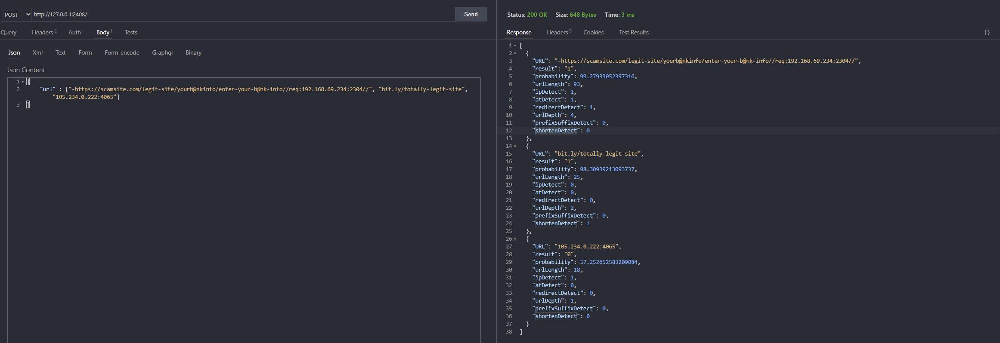

Get the .pkl file and dataset here: https://drive.google.com/drive/folders/16h0OXr9MLflHamHZZBDPn_nFmIjL1Rnt?usp=sharing

To run the python webapp, download both ```phishing_detector.pkl``` and ```webdetector.py```, point to the correct local path of ```phishing_detector.pkl``` then run ```webdetector.py```, submit requests via POST to ```http://127.0.0.1:2408/```   

Libraries needed: uvicorn. fastapi, joblib, pydantic, sklearn

Follow the format here (0 is not malicious, 1 is malicious):



**url must be a list even if there's only one item**
